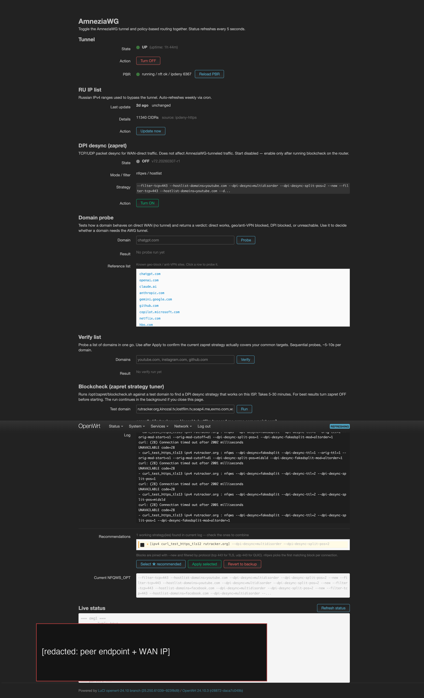
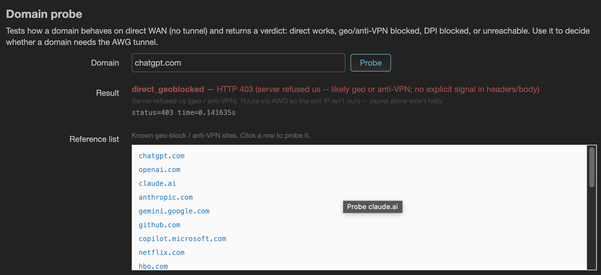
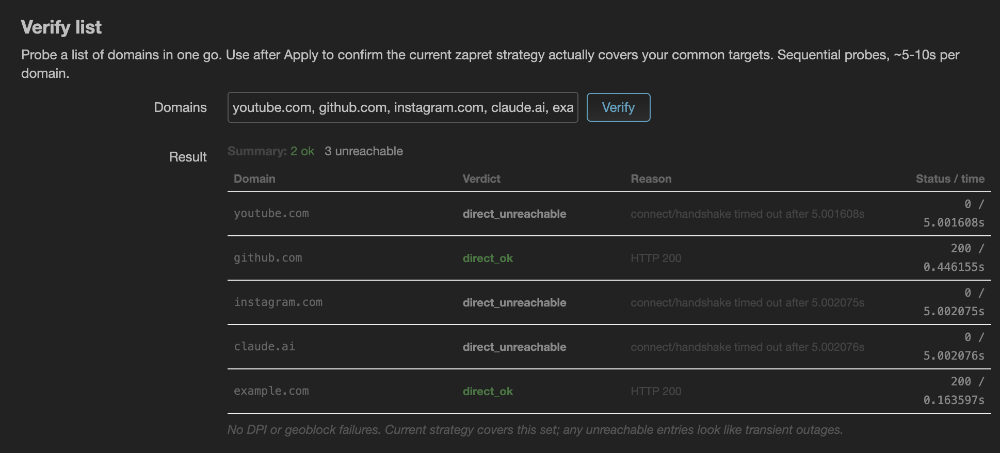
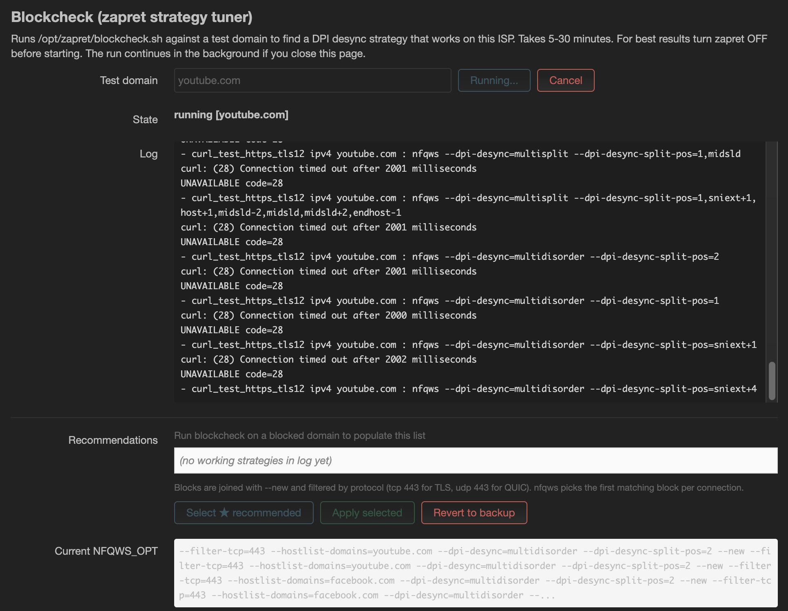

# amnezia-pbr-openwrt

**Languages:** English (this file) · [Русский](README.ru.md)

OpenWrt router config for **AmneziaWG** + **policy-based routing** with
**RU bypass** and an optional **zapret DPI desync** layer, plus a LuCI
panel that wraps it all.

What you get on the router:

- `awg1` AmneziaWG interface (kmod + tools from
  [Slava-Shchipunov/awg-openwrt](https://github.com/Slava-Shchipunov/awg-openwrt)).
- Policy-based routing (`pbr` + `luci-app-pbr`) sending LAN traffic
  through `awg1` by default, with the standard `.ru` TLDs and the
  current ipdeny RU IPv4 list routed direct (so banks, госуслуги, mail.ru
  etc. don't tunnel).
- `zapret` (DPI desync, from
  [remittor/zapret-openwrt](https://github.com/remittor/zapret-openwrt))
  installed but disabled by default — you turn it on from LuCI after
  finding a strategy that works on your ISP.
- A LuCI page at **Network → Amnezia** with:
  - tunnel + PBR status, one-click toggle
  - weekly RU CIDR refresh
  - **Domain probe** to classify how a site fails on direct WAN
  - **Verify list** to check a set of domains in one go after applying
    a strategy
  - **Blockcheck** runner with live log + apply/revert of recommended
    nfqws strategies

## Screenshots

| | |
|---|---|
|  |  |
| Tunnel + PBR + RU list + zapret status, one place. | Probe a domain, get a verdict + recommendation. |
|  |  |
| Re-probe N domains after Apply with summary chips and an action hint. | Run upstream blockcheck.sh with a live log; one-click Apply of the recommended nfqws strategy. |

## Install

Two paths -- pick one. Both end at the same configured router; the
difference is how updates work afterwards.

**Before either path, place your Amnezia-exported .conf** at
`/etc/amnezia/awg.conf` (the file with `Jc / Jmin / S* / H* / I*` lines
under `[Interface]` -- export it from the Amnezia desktop client:
*Settings → Connection → Export config*).

```sh
mkdir -p /etc/amnezia
vi /etc/amnezia/awg.conf
# paste the exported config, save, quit
```

### Path A: one-line installer (simplest)

```sh
wget -O - https://raw.githubusercontent.com/JonniK/amnezia-openwrt/main/install.sh | sh
```

Pulls a tarball of this repo, stages the wrappers to `/usr/bin/`, runs
the install pipeline. Updates require re-running the same command.
Good for first install or one-off setups.

### Path B: opkg .ipk packages (native, updateable)

```sh
ARCH=$(. /etc/openwrt_release && echo "$DISTRIB_ARCH")
REL=v0.2.0   # or whatever the latest release tag is

cd /tmp
for pkg in amnezia-pbr luci-app-amnezia; do
  wget -O "${pkg}.ipk" \
    "https://github.com/JonniK/amnezia-openwrt/releases/download/${REL}/${pkg}_0.2.0-r1_all.ipk"
done

opkg install ./amnezia-pbr.ipk ./luci-app-amnezia.ipk
amnezia-pbr-setup     # downloads AmneziaWG kmod + zapret, configures UCI
```

Native opkg integration -- `opkg upgrade amnezia-pbr` picks up wrapper
updates without re-running the bootstrap. `opkg remove` cleanly
uninstalls. UCI config (`/etc/config/amnezia`) and `/etc/amnezia/awg.conf`
are package conffiles, so user edits survive upgrades.

Either path: WAN is pinged before and after every destructive step, the
network is never fully restarted, and `/tmp/openwrt-deploy.log` ends
with `DEPLOY_DONE` or `DEPLOY_FAILED`. Re-run safely after fixing
anything -- idempotent.

### Install options

| Env var | Default | Effect |
|---|---|---|
| `STEPS` | `3` | `1` = AWG + firewall only, `2` = +PBR, `3` = +RU bypass |
| `AWG_CONF` | `/etc/amnezia/awg.conf` | Where to read AWG keys/params from |
| `REPO_REF` | `main` | Branch/tag to install from |
| `AWG_VER` | `24.10.3` | Slava-Shchipunov ipk release pin |

### Where things live

| Path | Purpose |
|---|---|
| `/etc/amnezia/awg.conf` | Your AmneziaWG client config (you provide it) |
| `/etc/amnezia/ru.cidr` | Current ipdeny RU IPv4 list (refreshed weekly) |
| `/etc/amnezia/ru-update.json` | Stamp of last refresh |
| `/etc/amnezia/blockcheck.json` | Stamp of last blockcheck run |
| `/etc/amnezia/seed-must-tunnel.list` | Reference list of known anti-VPN / geo-block sites |
| `/etc/amnezia/zapret-backups/` | Per-Apply backups of `NFQWS_OPT` |
| `/opt/zapret/config` | Active zapret config (`NFQWS_OPT` lives here) |
| `/etc/pbr.d/99-lan-vpn.sh` | PBR include: LAN → awg1 |
| `/etc/pbr.d/ru-direct.sh` | PBR include: RU CIDRs → WAN direct |

### Supported hardware

Tested on **aarch64 mediatek/filogic** (Xiaomi AX3000T, Banana Pi BPI-R4,
etc.) on OpenWrt 24.10.3.

The installer auto-detects `DISTRIB_ARCH` and `DISTRIB_TARGET` to pick
the right AmneziaWG kmod ipk from Slava-Shchipunov's releases, so other
targets *should* work as long as a matching ipk exists for your kernel.
mips_24kc is intended but untested.

## When zapret helps and when it doesn't

zapret performs DPI desync on egress packets after they've left the
router but before they hit the ISP's TSPU. It can help when:

- A site is **DPI-blocked**: TSPU lets the SYN through, parses the
  ClientHello's SNI, then RSTs the connection. zapret rewrites the
  ClientHello (split, fakedsplit, multidisorder, etc.) so the SNI
  isn't parseable. This is the classic case it's designed for.

It **cannot help** when:

- A site is **SYN-blocked**: TSPU drops the first packet of the
  handshake by destination IP. zapret operates on packets that reach
  it; if the SYN dies upstream, there's nothing to desync. In 2026
  Russia this is the dominant block mode for many western services
  (Instagram, Facebook, X, LinkedIn, often YouTube).
- A site does **server-side anti-VPN** (Cloudflare's `cf-mitigated`,
  OpenAI's region check, Netflix). The block is based on your IP, and
  no packet-level desync changes the IP. Only the tunnel (with a
  non-flagged exit) helps.

The LuCI panel makes the distinction with three tools:

- **Domain probe** classifies one domain into `direct_ok`,
  `direct_dpi_blocked`, `direct_geoblocked`, or `direct_unreachable`.
- **Blockcheck** runs the upstream `/opt/zapret/blockcheck.sh` and
  surfaces a recommended `--dpi-desync=...` strategy when one works.
- **Verify list** then re-probes a list of domains with the applied
  strategy live, so you can see whether the recommendation actually
  helps on your real targets (blockcheck often gets a false positive
  by testing against `iana.org` IPs rather than the real destination).

If most of your blocked sites are SYN-blocked, leaving zapret off and
sending those domains through the tunnel is the right answer. zapret
is most valuable when it lets you keep high-bandwidth, DPI-only sites
on direct WAN to free the tunnel from carrying the load.

## Repo layout

```
install.sh                  Public bootstrap (this is what users run)
openwrt/
  install-amnezia-pbr.sh    Main installer pipeline (runs on the router)
  install-zapret.sh         zapret package + wrappers + ncat-full
  install-luci-app-amnezia.sh   LuCI menu/acl/view + cron
  install-luci-toggle.sh    LuCI System->CustomCommands toggle entries
  install-dnsmasq-full.sh   Swap to dnsmasq-full (needs nftset support)
  configure-dnsmasq-ru-nftset.sh   .ru TLD -> pbr_ru_tld4 nftset directive
  awg-{toggle,status,ru-update}.sh    AWG wrappers
  pbr-{status,reload}.sh    PBR wrappers
  zapret-{toggle,status,blockcheck,apply,probe,verify}.sh   zapret wrappers
  seed-must-tunnel.list     Reference list of geo-blocked sites
  pbr.d/                    PBR include files
  luci-app-amnezia/         LuCI app (menu, acl, view/main.js)
docs/                       Design notes (plan-b: inverted PBR architecture)
dev/                        Maintainer-side SSH tooling (not for end users)
local/                      Your private AWG config (gitignored)
```

## License

GPLv2. See LICENSE.

## See also

- [docs/plan-b-inverted-pbr.md](docs/plan-b-inverted-pbr.md) — design
  notes for the "direct default + zapret + selective must-tunnel"
  routing architecture that's the next major iteration.
- [docs/ru-tld-bypass.md](docs/ru-tld-bypass.md) — how the `.ru` TLD
  bypass works via dnsmasq nftset.
- [README.ru.md](README.ru.md) — русская версия.
